**Описание данных**

Вам представлены данные о доходах сотрудников участка горячего проката за год, в том числе данные, описывающие специфику рабочих мест. Доход состоит из оклада, премии, доплат и индивидуальных надбавок. Данных об их размерах не приводится, так как именно их Вам предстоит восстановить.  

**Задание**

* Выявите формулу дохода в целом и его составных частей
* Проверьте, что данная формула объясняет доход с точностью до рубля
* Выявите зависимости между составными частями дохода 

**Первые шаги**

Сравнив графики производства и среднего дохода можно заметить не линейный характер зависимости, наверно в формуле есть порог по плану так как доход за 5 месяцев одинаков несмотря на разные объемы производства.

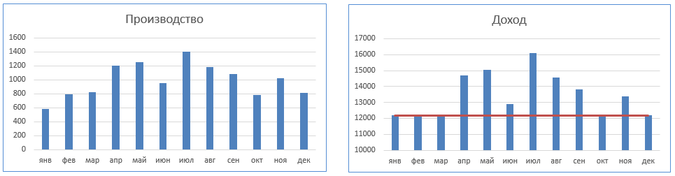

На сводной таблице оборудования, вредности и разряда видно, что доход растет вместе с увеличением вредности и ростом разряда. При этом при одинаковых разряде и вредности доход не меняется при изменении оборудования.

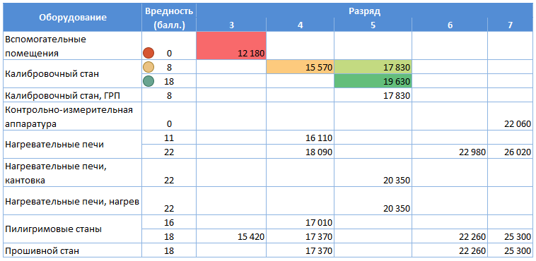

Поменяв положение столбцов и строк можно убедится,  что наименование оборудования не влияет на доход.

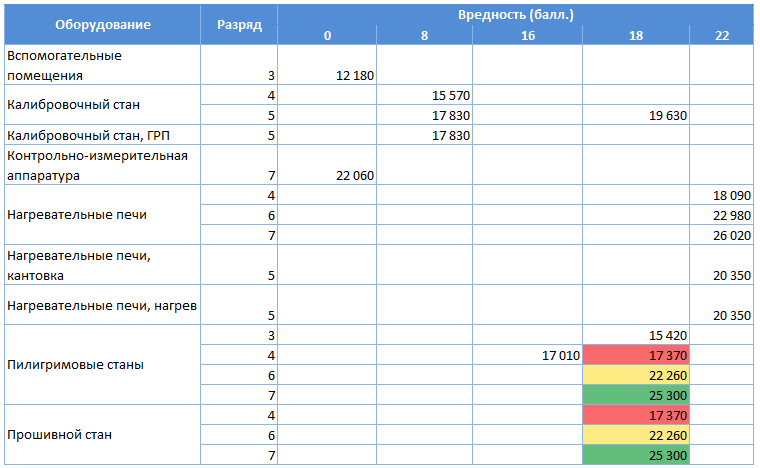

**Определение коэффициента доплаты за вредность**

Для дальнейшей работы отфильтруем таблицу по дате - возьмем январь (минимальный объем производства).

В сводной таблице за январь только одна профессия, у которой есть две записи с разными уровнями вредности, но одним разрядом.

Нетрудно посчитать, что доплата на каждый уровень вредности составляет (15420 - 12180) / 18 = 180 рублей.

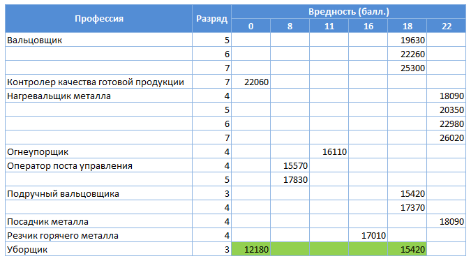

После этого можно посчитать базовый оклад по каждой профессии по разрядам без учета доплат за вредность.

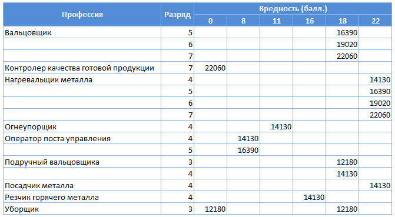

Собрав все чистые оклады и объединив их только по разрядам получим таблицу, которая после удаления дубликатов даст таблицу зависимости оклада от разряда, что свидетельствует о том, что профессия не влиент на оклад.

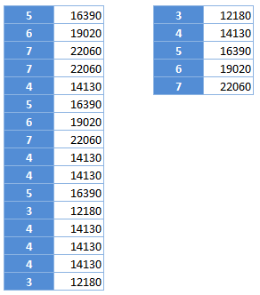

**Расчет вариантов и размера индивидуального премирования**

Для данного расчета вновь возьмем январь и сделаем свод по уборщикам, так как у них один разряд (3).

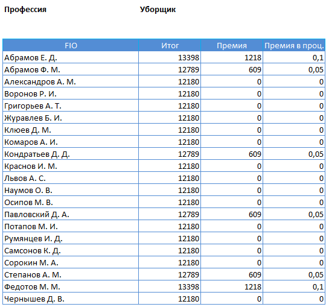

Посчитаем разницу в рублях и получим всего три варианта:

* 0 рублей - премии нет
* 609 рублей - премия 5% от базового оклада
* 1218 рублей - премия 10% от базового оклада

Далее применяем такую же логику для всех оставшихся работников - получим таблицу длиной 200 строк, где каждая строка - ФИО и размер постоянной премии в процентах от базового оклада.

**Нахождение порога по плану производства**

Построим сводную по доходу и производству, видна зависимость - увеличение производства влечет увеличение дохода. Если построить график - видно изменение линейной зависимости при достижении уровня 900 единиц продукции.

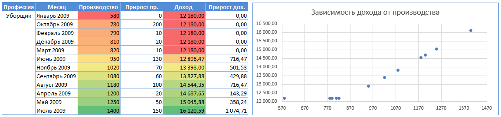

Рассмотрим подробнее, обрезав все значения ниже 950.

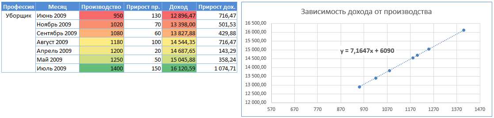

Тренд линейный, но чтобы оценить качество построим график зависимости прироста премии от прироста производтсва.

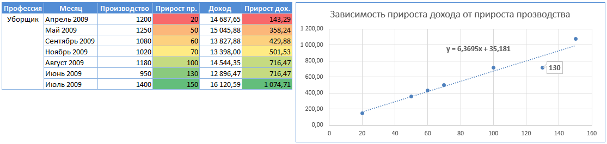

Одна точка явно выбивается из тренда, это разница между 950 и 820, если поменять нижнюю точку методом перебора на 850, получим линейный тренд увеличения дохода,

значит порог по производству - 850 единиц.

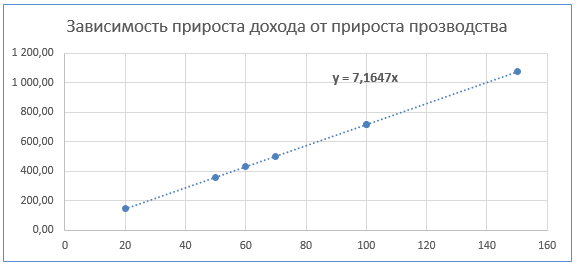

**Расчет стоимости каждой единицы сверх плана**

Построим таблицу прироста производства (факт минус план 850) и минимального дохода (доход минус базовый оклада за разряд).

Видна зависимость - при приросте сверх плана на 20% получили 10% от оклада.

Значит формула для расчета премии за перевыполнение плана: факт минус план (850) разделить на два и умножить на оклад.

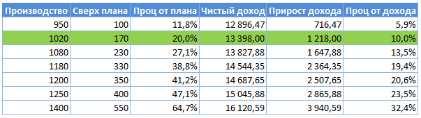

**Расчет индивидуальных коэффициентов премии**

Сведем в таблицу полученные данные, расчитав доход как результат сложения оклада (зависит от разряда и индивидульного премирования), премии за перевыполнение плана и надбавки за вредность. Это колонка базовая премия, отнимем ее от дохода из исходной таблицы, получим разницу, которая обозначена как "премия к премии".

Нетрудно заметить, что она пропорциональна индивидуального процента премирования, расчитанного ранее.

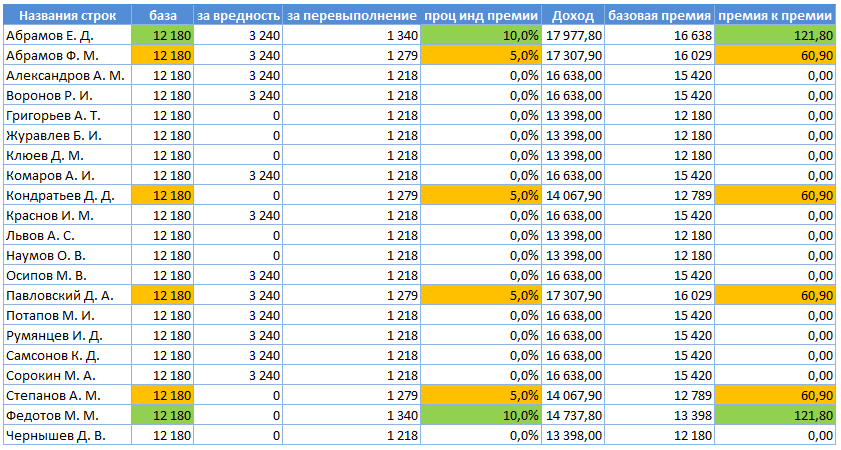

**Итог**

Полученная формула объясняет размер заработной платы с точностью 1е-5, итоговый результат можно найти в приложенном файле payroll_formula.xlsx
